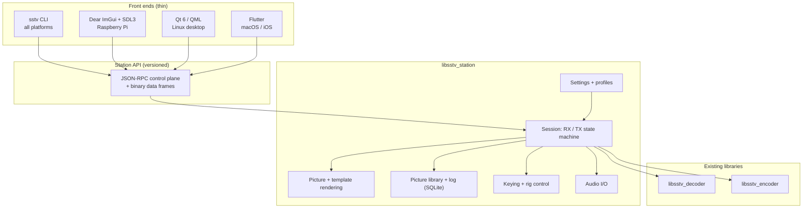

# Application architecture

How the station application is put together, and why. Requirements are in
[application-requirements.md](application-requirements.md); decisions with
their trade-offs are recorded as [ADRs](../decisions/).

This document covers structure. Three companions specify the detail a
developer needs to write code:

| Document | Specifies |
| --- | --- |
| [session-behaviour.md](session-behaviour.md) | States, transitions, timeouts, failure handling, multi-client rules, degraded modes |
| [api-specification.md](api-specification.md) | Methods, events, framing, errors, back-pressure, versioning, security |
| [data-model.md](data-model.md) | Database schema, on-disk layout, configuration keys, template documents, ADIF mapping |

## Names

The product is **PocketSSTV**. The repository keeps the name
`mmsstv-portable`, which credits the origin; the shipped software does not
lead with another project's name.

| Thing | Name |
| --- | --- |
| Product, packages | PocketSSTV, `pocketsstv` |
| Daemon | `pocketsstvd` |
| Command-line client | `pocketsstv` |
| Station core library | `libsstv_station` |
| Signal libraries (unchanged) | `libsstv_encoder`, `libsstv_decoder` |
| Config, data, state | `pocketsstv/` under the platform's directories |

## The shape of it

Everything that is not pixels on a screen lives in one place: a **station core
library**. It owns the audio devices, the decoder and encoder, keying, rig
control, the picture library, the log and the settings. It exposes one API.

That core is deployed two ways:

- **Hosted**: a daemon process (`pocketsstvd`) owns the hardware, and clients — the
  CLI and the GUIs — connect over a local socket. This is the shape for
  Raspberry Pi and Linux, and it is what lets a headless Pi in the shack be
  driven from a laptop on the sofa.
- **Embedded**: the same library linked into the application process and
  called directly. This is mandatory on iOS, where a background daemon is not
  permitted, and is optional on macOS.

The API is the same either way: the transport differs, not the vocabulary.
Front ends are written against one client library that hides which shape they
are talking to. See [ADR-0001](../decisions/0001-core-library-and-daemon.md).



Deployment topologies per platform are drawn in
[docs/diagrams/deployment.drawio](../diagrams/deployment.drawio).

## Why the core is not in the GUI

Three front ends are being built ([ADR-0002](../decisions/0002-three-front-ends.md)):
Dear ImGui for the Pi, Qt/QML for Linux, Flutter for Apple platforms. Any
logic that lives in a front end gets written three times and behaves three
ways. So the rule is blunt:

> A front end may lay out pixels, animate them, and turn gestures into API
> calls. Everything else belongs in the core.

Mode timing, slant correction, template rendering, file naming, ADIF, the
decision about when a picture is "complete" — core. A front end that needs a
new behaviour asks for a new API call rather than implementing it locally.

This also makes the CLI honest: it is a client of the same API, so anything
the GUI can do is scriptable by construction (`R-CLI-2`, `R-CLI-5`).

## Modules

| Module | Owns | Notes |
| --- | --- | --- |
| `audio` | Device enumeration, capture and playback streams, level metering, clock calibration | One real-time callback per direction; no allocation, no locks, no I/O inside it |
| `session` | The RX and TX state machines, the current QSO context | The only module that may drive the encoder, decoder and keying |
| `pictures` | Decoding and encoding image files, geometry fitting, template rendering | Deterministic: same inputs, same pixels, on every platform |
| `library` | Stored pictures, metadata, search, retention | SQLite index, images content-addressed on disk |
| `log` | Contacts, ADIF import and export | Same database, separate schema |
| `rig` | Keying backends and hamlib rig control | Includes the PTT watchdog |
| `config` | Settings, station identity, profiles, migration | Plain TOML, documented key by key |
| `api` | Request dispatch, event streams, authentication | Transport-agnostic; the daemon and the embedded build share it |

Modules depend downwards only. `session` may call `audio`; `audio` knows
nothing of `session`.

## Threading

Audio callbacks are real time and sacred. The design around them:

- **Capture callback** copies samples into a lock-free ring buffer and returns.
- **Decode worker** drains the ring, feeds `libsstv_decoder`, and publishes
  events (line ready, mode detected, picture complete).
- **Encode worker** fills the playback ring ahead of the **playback
  callback**, which only copies.
- **Control thread** handles API requests, storage and rig I/O. Serial and
  hamlib calls can block for tens of milliseconds and must never touch the
  audio path.
- **Event bus** fans out to subscribers; slow clients are dropped from
  high-rate streams rather than allowed to stall the producer.

Persisting received lines as they arrive (`N-3`) happens on the control
thread, from the same events the UI consumes.

Budgets, so the pieces can be sized before they are written:

| Quantity | Target |
| --- | --- |
| Audio callback period | 10–20 ms; a callback must finish in well under 1 ms |
| Capture ring | 2 s, so a stalled worker degrades rather than loses audio |
| Playback pre-fill | 500 ms before keying, refilled to stay above 250 ms |
| Waterfall | 1024-point FFT, Hann window, 20 columns per second by default |
| Event latency | Under 50 ms from decode to a local subscriber (`N-11`) |
| Decode CPU | Under 25% of one Pi 4 core (`N-1`) |

Ownership rule: the decoder and encoder instances belong to their workers and
are never touched from the control thread. State the UI needs is published as
events, not read across threads.

## Multi-client behaviour

The daemon serves several clients at once, which makes transmit arbitration a
safety concern rather than a convenience: two clients must not be able to key
the radio. Receiving and browsing are shared; transmitting requires a leased
exclusive lock; configuration changes are serialised and broadcast. The rules
are in [session behaviour](session-behaviour.md#multi-client-rules) and the
reasoning in [ADR-0009](../decisions/0009-transmit-arbitration.md).

## Failure and recovery

Every failure mode that matters — device loss, PTT refusing to assert or
release, disk full, database corruption, rig disconnection, client
disconnection, daemon restart mid-transmission — has a defined behaviour, an
event and a test. They are tabulated in
[session behaviour](session-behaviour.md#failure-taxonomy) rather than
duplicated here.

Two rules shape all of them: **release keying before anything else** on
startup and shutdown, and **never corrupt stored data to keep running**.

## Observability

No telemetry ever leaves the machine (`N-5`), so local observability has to be
good enough to debug from a distance:

- Structured logs with levels, to the journal on Linux and the platform log
  elsewhere, plus a station journal of on-air actions in plain language
  (`R-OPS-1`).
- A diagnostics bundle command that collects versions, devices, rig, recent
  log, and the last decode's quality summary, redacted by default (`R-OPS-2`).
- An optional rolling audio buffer, so an operator can attach the audio that
  failed to decode and a developer can replay it into the fake audio device.

## The API

A control plane and a data plane over one connection:

- **Control**: JSON-RPC 2.0. Requests like `session.startRx`,
  `session.transmit`, `library.query`, `rig.setFrequency`, `config.set`.
  Human-readable, trivially scriptable, and every language we need has a
  client. Errors carry a code, a message and a remediation hint.
- **Data**: length-prefixed binary frames for waterfall columns, scan lines
  and picture tiles. Base64 in JSON would cost more CPU than the decoder uses.
- **Events**: subscriptions delivered on the same connection, so a client sees
  a consistent ordering of "mode detected", "line 42", "picture complete".

Transports: a Unix domain socket locally (permissions restrict it to the
local user, `N-6`), WebSocket for opt-in network access with a token and TLS
(`R-CLI-6`). The embedded build calls the same dispatch in-process, skipping
serialisation for bulk data.

The schema is versioned and published as JSON Schema in the repository;
clients negotiate a version at connect. See
[ADR-0005](../decisions/0005-api-protocol.md).

## Audio

One thin abstraction over platform backends, because there is no single
library that is excellent everywhere:

| Platform | Backend |
| --- | --- |
| Raspberry Pi, Linux | ALSA directly, PipeWire where present |
| macOS, iOS | CoreAudio, with an `AVAudioSession` policy on iOS |

[miniaudio](https://miniaud.io) is the proposed implementation for all of
them: one permissively licensed file, covers every target including iOS, and
does not drag a dependency tree onto a Pi image.
[ADR-0004](../decisions/0004-audio-backend.md) records the alternatives
(PortAudio, RtAudio, native per platform).

Resampling is ours, not the backend's: the device runs at its native rate and
the core resamples to what the decoder wants, so a cheap USB dongle locked to
44.1 kHz behaves like anything else (`R-AUD-2`).

## Radio control

`hamlib` replaces the original's hand-written CAT strings
([ADR-0003](../decisions/0003-hamlib.md)). It is LGPL, supports hundreds of
radios, and is packaged on every target distribution. Two ways in:

- **Linked** (`libhamlib`) on Pi, Linux and macOS, for a directly attached
  radio.
- **Networked** (`rigctld` over TCP) for iOS, and for the case where the radio
  hangs off a different machine than the one running the UI (`R-RIG-4`).

Keying is separate from CAT, because most stations key without it:

| Backend | Where |
| --- | --- |
| Serial RTS/DTR | Everywhere with a serial interface |
| CAT PTT via hamlib | Where the radio supports it |
| CM108-style USB audio HID GPIO | Common cheap interfaces |
| Raspberry Pi GPIO (`libgpiod`) | Pi with a transistor keying circuit |
| VOX (no keying at all) | Apple platforms, and anyone acoustically coupled |

**The PTT watchdog is not optional.** A transmitter stuck keyed is the worst
failure this application can produce: it is an interference incident and,
depending on the radio, hardware damage. The rules:

1. Keying is armed with a maximum duration derived from the mode's length plus
   a margin. The watchdog is independent of the audio path.
2. If audio stops, the API disconnects, or the process crashes, the interface
   is released. Serial lines drop on file-descriptor close; GPIO is configured
   so the released state is receive.
3. Failure to release is reported loudly and repeatedly (`R-RIG-5`), not
   logged once.

## Pictures and templates

Templates must render identically on a Pi, a phone and a desktop (`R-IMG-7`),
so rendering happens in the core, never in a front end's drawing API. A
template is a document — layers, geometry, styles and text bound to QSO
fields — stored as JSON, rendered to RGB by a vector rasteriser with proper
text shaping for non-Latin callsign and comment text.
[ADR-0007](../decisions/0007-template-rendering.md) weighs the candidates.

Format support (`R-IMG-1`) uses the platform-independent decoders
(libjpeg-turbo, libpng, libwebp) rather than platform image APIs, for the same
reason: one behaviour everywhere.

## Storage

- **Images**: files on disk, content-addressed, in a directory the operator
  can back up and point other tools at. No database blobs.
- **Index, log and metadata**: one SQLite database. It is on every platform,
  it survives power loss, and it makes `R-LIB-2` a query instead of a
  directory walk.
- **Settings**: TOML, one file, documented ([ADR-0008](../decisions/0008-storage.md)).
- **Locations**: platform conventions (XDG on Linux and Pi, Application
  Support on macOS, the app container on iOS).

## Licensing boundaries

This matters more than usual, because the core is LGPL v3 (inherited from
MMSSTV) and one target is the App Store.

| Component | Licence | Consequence |
| --- | --- | --- |
| `libsstv_encoder`, `libsstv_decoder` | LGPL v3 (inherited) | Must remain relinkable: dynamic framework on Apple platforms, shared library elsewhere |
| `libsstv_station`, `pocketsstvd`, CLI, front ends | Apache-2.0 ([ADR-0015](../decisions/0015-licensing-of-new-components.md)) | Patent grant; App Store compatible; others may embed |
| hamlib | LGPL 2.1+ | Same treatment |
| Dear ImGui, SDL3, miniaudio | MIT / zlib / public domain | No constraint |
| Qt 6 | LGPL v3 | Linux front end ships it dynamically; distribution documented |
| Flutter engine | BSD | No constraint |

The Apple build therefore keeps every LGPL component in dynamically linked
frameworks, and the project publishes the object files and instructions needed
to relink. This is the known-workable path, but it needs a legal review before
the first submission, and it constrains the module layout from the start —
which is why it is written down now.
[ADR-0006](../decisions/0006-licensing-and-app-store.md) has the detail.

## Repository layout

A single repository. The library, the core, the daemon and three front ends
change together often enough that splitting them would cost more than it
saves.

```text
include/, src/          existing encoder and decoder libraries
core/                   libsstv_station: session, audio, rig, pictures, library, api
apps/pocketsstvd/             the daemon
apps/pocketsstv-cli/          the command-line client
apps/pi/                Dear ImGui + SDL3 front end
apps/desktop/           Qt 6 / QML front end
apps/mobile/            Flutter front end (macOS, iOS)
clients/                generated API clients (C, Dart) and the schema
utils/                  existing file-based tools
docs/                   documentation, as now
```

## Developing without hardware

The stack runs with `--audio fake --rig fake`: a fake audio device that plays
recordings into the capture path, a scriptable fake rig, a loopback keying
interface that reports what was asserted, and a virtual clock. This is built
in M0, before the features that depend on it, because otherwise front-end and
core work both queue behind sound cards and radios. Details in
[the test strategy](test-strategy.md#simulation-so-nothing-waits-for-hardware)
and [ADR-0011](../decisions/0011-simulation-first-development.md).

## Platform lifecycles

Desktop and Pi deployments are long-running processes. Apple platforms are
not, and the embedded shape has to cope:

- iOS suspends applications. A transmission must complete or abort cleanly on
  suspension, keying released first, and state restored on resume.
- Audio session interruptions (a phone call, a route change to Bluetooth)
  abort transmission and pause receiving with an explanation, rather than
  producing a corrupt picture.
- Background audio is declared so receiving can continue with the screen
  locked; the picture library and log are committed continuously so a
  termination loses nothing.
- macOS may use either shape: embedded by default, or a daemon when the
  operator wants the station to keep running with no window open.

## Testing

| Layer | How |
| --- | --- |
| Encoder and decoder | The existing suite, unchanged |
| Core modules | Unit tests; the session state machine tested against recorded audio with no hardware |
| Keying | A loopback interface that reports the keyed line, so the watchdog is proven |
| API | Contract tests against the published schema, run for every client |
| Front ends | Scripted walkthrough of the QSO flow on real hardware before release |
| Packaging | Every artefact installed and launched in CI on a clean image |

The end-to-end test that matters most: feed a recording to the daemon, and
assert the stored picture, its metadata and the log entry.

The full strategy, including interoperability with other SSTV software,
fuzzing, soak testing and the hardware bench, is in
[the test strategy](test-strategy.md).
