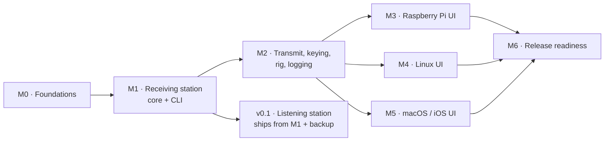

# Application roadmap

The order of work for the station application. The library itself has its own
track in [production-roadmap.md](production-roadmap.md); it is a dependency of
everything here and continues in parallel.

No dates. Sizes are relative (S, M, L) and the sequence is what matters,
because how long each takes depends entirely on who is working on it. Each
milestone is shippable: it ends with something an operator can actually use.

Milestones are decomposed into stories with acceptance criteria in
[the feature backlog](feature-backlog.md); M0 to M2 are decomposed now, later
milestones when they start. Every story carries the
[Definition of Done](devops-and-delivery.md#definition-of-done), and every
milestone must pass the gates in
[the test strategy](test-strategy.md#gates).

The three UI milestones are independent once M2 lands, and can run in any
order or in parallel.

## The minimum viable station

Six milestones and three front ends is years of one person's evenings. So the
plan names the smallest thing that is genuinely worth using, ships that, and
treats everything after it as optional.

**v0.1 — the listening station.** A Raspberry Pi Zero 2 W, headless, that
receives SSTV and keeps everything it hears: automatic mode detection, slant
correction, a searchable picture library with metadata, backup, and a CLI to
drive and inspect it. No transmit, no GUI, no rig control.

That is a real product. It is useful to the person who builds it on day one,
it runs unattended on hardware already owned, it is entirely testable with
recordings and virtual devices, and it needs no radio, no licence and no
purchase. It is a subset of M1 plus backup, and it is the first thing to aim
at.

Everything else is sequenced behind it, and can stop at any point without
leaving something useless.

### What gets cut, in order

When time runs short — and it will — cut from the bottom:

| Cut order | Scope | What is lost |
| --- | --- | --- |
| 1 | The tone-access repeater (P4) | Unattended beacon still works |
| 2 | Satellite scheduling (S3), FSK identifier, contest fields | Manual capture still works |
| 3 | The Apple front end (M5) | The CLI and a desktop GUI remain; iOS was always the largest single piece |
| 4 | A second desktop front end | One GUI, whichever is chosen at M3 |
| 5 | Template editing in the interface | Templates still render; they are edited as files |
| 6 | Remote access (J) | Local operation is unaffected |
| **Never cut** | The keying watchdog, identification, band-plan guards, backup | These are the difference between a hobby project and a liability |

The bottom row is the point of writing this down: under time pressure the
temptation is to cut safety work, because nothing visible breaks when you do.

## M0 · Foundations (S)

Set up what everything else assumes, before there is much to argue about.

- Repository layout as in
  [the architecture](application-architecture.md#repository-layout).
- CI across the target matrix: Pi (arm64), Ubuntu, macOS; build, test, lint.
- `libsstv_station` skeleton with the module boundaries, plus the audio
  abstraction and one backend.
- API schema skeleton, versioning rules, error envelope, and the generated C
  client ([ADR-0010](../decisions/0010-versioning-and-compatibility.md)).
- **The simulation harness**: fake audio device, loopback audio, fake rig,
  loopback keying, virtual clock, fault injector, session replay
  ([ADR-0011](../decisions/0011-simulation-first-development.md)). This is on
  the critical path: everything after it is faster, and CI is meaningless
  without it.
- Configuration and storage bootstrap: TOML, `config.describe`, database
  creation, integrity check, migration runner.
- Structured logging and the station journal.
- Contribution, style and review practice written down
  ([engineering practices](engineering-practices.md),
  [devops and delivery](devops-and-delivery.md)).

**Exit:** a daemon that starts with `--audio fake --rig fake` on a machine
with no sound card, reports its version over the socket, rejects a
mismatched client with a clear error, and is built and tested by CI on all
three architectures.

Backlog: [epic A](feature-backlog.md#a-foundations).

## M1 · Receiving station, core and CLI (L)

The first genuinely useful thing: a Pi that listens and keeps what it hears.

Requirements: `R-RX-1…9`, `R-RX-11`, `R-AUD-1…4`, `R-AUD-7`, `R-LIB-1…2`,
`R-LIB-6`, `R-CLI-1…5`, `R-OPS-1…3`, `R-TIME-1`, `N-1…4`, `N-11…14`.

- Audio capture, device selection, level metering, clock calibration.
- Session state machine: idle, hunting, receiving, complete; automatic and
  manual start; auto stop and resync.
- Decoder integration, including slant correction and its manual override.
- Waterfall and spectrum data published as events.
- Picture library: storage, metadata, search, retention.
- `pocketsstv` CLI: `monitor`, `status`, `pictures`, `decode`, `config`, with JSON
  output on every command.
- Multi-client handling and the transmit lock, before anything can transmit
  ([ADR-0009](../decisions/0009-transmit-arbitration.md)).
- Clock-quality handling, so an unattended Pi with no real-time clock does not
  write 1970 into the library.
- Storage budget, disk-full behaviour and `library.repair`.
- Backup and restore, because the station lives on an SD card
  ([epic Q](feature-backlog.md#q-data-portability)).
- An occupancy detector, which unattended transmission later depends on.
- Diagnostics bundle and local crash reports.
- systemd unit, logging to the journal.

**Exit:** a headless Pi receives unattended for a week, stores every picture
with metadata, survives device unplugging and a power cut mid-picture, and
stays within the CPU and memory budgets. The integration test feeds a
recording to the daemon and asserts the stored picture, its metadata and its
quality summary; the 72-hour soak passes; interoperability decoding of other
software's recordings passes for the common modes.

Backlog: [epics B to E](feature-backlog.md#b-audio).

**Not yet:** transmitting, templates, rig control, any GUI.

## M2 · Transmit, keying, rig control and logging (L)

Everything needed for a complete QSO from the command line.

Requirements: `R-TX-1…7`, `R-TX-10…13`, `R-IMG-1…7`, `R-IMG-9`, `R-RIG-1…7`,
`R-LOG-1…3`, `R-LOG-5`, `R-AUD-5…6`, `R-INT-1…3`, `R-NET-2`.

- Playback path and encoder integration; TX progress events.
- Keying backends: serial, CAT via hamlib, CM108, Pi GPIO, VOX. **The PTT
  watchdog and its loopback test land here, before any UI can key a radio.**
- hamlib rig control, linked and over the network.
- Picture pipeline: format support, geometry fitting, crop.
- Template documents and the core renderer, with QSO field binding.
- Log with ADIF import and export, pictures linked to contacts.
- Transmit drive calibration, with peak metering and clipping detection.
- Repeater tone sequences, and unattended or scheduled transmission.
- Band and frequency presets, and manual frequency entry when no rig is
  connected.
- Remote pairing with tokens and TLS, with remote transmit a separate
  permission that is off by default.
- Regulatory guardrails before anything transmits unattended: band plan and
  privileges, automatic identification, automatic-control limits
  ([epic O](feature-backlog.md#o-regulation-and-on-air-safety),
  [ADR-0014](../decisions/0014-regulatory-guardrails.md)).
- Beacon and unattended operation, ported from MMSSTV's repeater mode
  ([epic P](feature-backlog.md#p-unattended-and-repeater)).
- CLI: `transmit`, `tune`, `rig`, `log`, `pair`.

**Exit:** a complete contact made from the command line on real hardware:
receive, compose with a template, transmit, log, export ADIF. The watchdog
test passes against the loopback keying interface, and a `SIGKILL` during
transmission leaves the line released after restart. Interoperability passes
both ways: MMSSTV and QSSTV decode our transmissions for every mode, and our
ADIF round-trips through a mainstream logger.

Backlog: [epics F to J](feature-backlog.md#f-transmitting).

## M3 · Raspberry Pi front end (M)

Dear ImGui + SDL3, built for a small touchscreen on a bench.

- Monitor and Compose screens, library and log browsing, station settings.
- First-run setup: callsign, audio devices, levels, optional keying test.
- Touch-first layout at 800×480 and 1024×600, dark by default.
- The unkey alarm screen.
- Runs on a Pi 4 and Pi 5 with the daemon local, and against a remote daemon.

**Exit:** an operator completes the full QSO flow on a Pi touchscreen without
a keyboard.

## M4 · Linux desktop front end (M)

Qt 6 / QML, for a desktop station.

- The same screens, laid out for a large display with Monitor and Compose
  visible together.
- Desktop conventions: menus, keyboard shortcuts, drag and drop, clipboard,
  window state.
- Template editor (the property-editor form over a template document).
- Packaging: Debian package and Flatpak.

**Exit:** installs from a package on current Ubuntu and drives a radio through
a USB interface.

## M5 · macOS and iOS front end (L)

Flutter over the embedded core through C FFI.

- Dart client for the API, and the embedded deployment shape.
- Platform integration: photo library, Files, share sheet, camera, background
  audio, notifications.
- iOS audio session policy and VOX-based operation with no cables.
- Network `rigctld` support for rig control.
- Packaging: signed macOS bundle, App Store build with LGPL components in
  dynamic frameworks, and the relinking instructions published.

**Exit:** an iPhone held near a radio completes a contact using VOX, and the
App Store submission passes the legal review recorded in
[ADR-0006](../decisions/0006-licensing-and-app-store.md).

## M6 · Release readiness (M)

- Internationalisation and the translator workflow; at least one non-English
  locale as proof.
- Accessibility pass against `R-CFG-5` on each front end.
- Documentation for operators, separate from the developer docs we have now.
- Reproducible release builds and signed artefacts for every platform.
- A public beta with real operators before 1.0.

## Risks

| Risk | Consequence | What we do about it |
| --- | --- | --- |
| A stuck transmitter | Interference, hardware damage, regulatory trouble | Watchdog designed in M2 before any UI can key; tested against loopback hardware; released state is receive |
| Three front ends drift apart | Different behaviour per platform, triple maintenance | Thin clients by rule; shared UX spec and tokens; contract tests against one API |
| App Store rejects an LGPL app | No iOS release, the weakest link in the plan | Dynamic linking decided in M0, legal review before M5 ends, TestFlight fallback |
| Pi performance under UI load | Dropped audio, corrupted pictures | Budget in `N-1`, measured in CI on real hardware from M1 |
| hamlib per-radio quirks | Rig control misbehaves on some models | Pin the version, keep keying independent of CAT, publish a tested-radio list |
| Template renderer choice is wrong | Rework in M2 or bloated iOS builds | Spike it before M2 commits; recorded in [ADR-0007](../decisions/0007-template-rendering.md) |
| Audio device variety | Works here, fails there | Native-rate handling and our own resampling from M1; a device compatibility list |
| Scope creep into image editing | Never ships | [Out of scope](application-requirements.md#out-of-scope) is explicit; defer to real editors |
| Two clients key the radio at once | On-air fault, possible damage | Exclusive transmit lease from M1, before transmit exists ([ADR-0009](../decisions/0009-transmit-arbitration.md)) |
| Version skew between daemon and front ends | Confusing failures in the field | Negotiated API version and explicit errors ([ADR-0010](../decisions/0010-versioning-and-compatibility.md)) |
| Development blocked on hardware | Slow delivery, untestable CI | Simulation harness in M0 ([ADR-0011](../decisions/0011-simulation-first-development.md)), then kernel virtual devices in containers ([ADR-0013](../decisions/0013-test-environments.md)) |
| Solo capacity: six milestones and three front ends is years of one person's time | The plan outlives its usefulness | Flow with a WIP limit of one, a walking skeleton first, and the front-end count revisited before M3 |
| The AI assistant cannot observe hardware | Confident claims about a station nobody checked | Human sign-off on every tier 0 change and on releases; automation (mutation tests, conformance suite) stands in for the missing second reviewer |
| Unattended Pi writes 1970 timestamps | Corrupt log, invalid ADIF | Clock-quality tracking and correction in M1 (`R-TIME-1`) |

## How this changes the old plans

The original plans in this directory targeted a library, and their scope
sections are now a subset of this one. They keep their historical banners;
this roadmap and
[the requirements](application-requirements.md) supersede their scope
statements. The library roadmap
([production-roadmap.md](production-roadmap.md)) remains live as the
dependency track: the API gaps it lists (a WAV decode helper, callbacks) are
consumed by M1 and M2 here.
