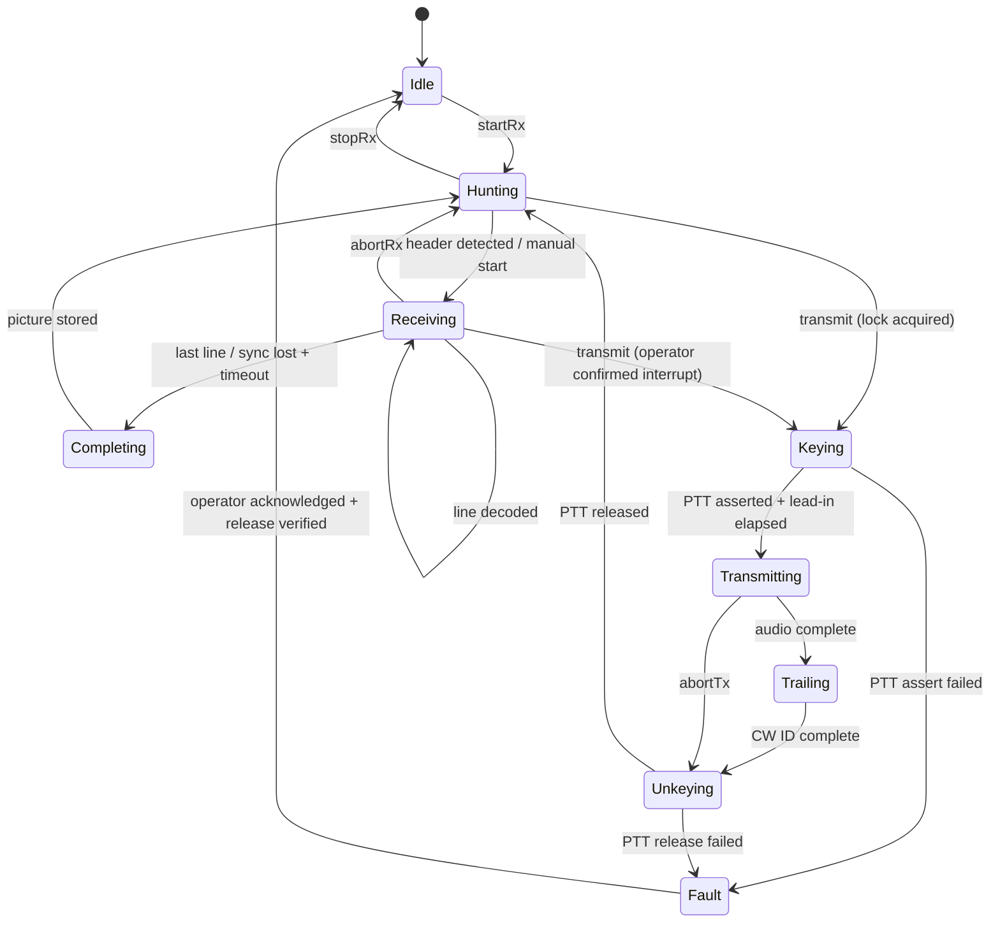

# Session behaviour

The station's observable behaviour: what state it is in, what moves it between
states, what happens when things fail, and who is allowed to do what. The
interface that exposes this is in [the API specification](api-specification.md);
the structures it stores are in [the data model](data-model.md).

This document exists because "the session state machine" was referenced three
times in the architecture without ever being defined. Everything below is
testable, and [the test strategy](test-strategy.md) requires each transition to
have a test.

## States

| State | Meaning | Audio | PTT |
| --- | --- | --- | --- |
| `Idle` | Not using the sound card. Devices may be reconfigured | Closed | Released |
| `Hunting` | Listening for a header, waterfall running. The resting state | Capture | Released |
| `Receiving` | A picture is arriving; lines are being decoded and persisted | Capture | Released |
| `Completing` | Finalising: flush the last line, write the picture and metadata | Capture | Released |
| `Keying` | PTT asserted, waiting out the lead-in delay before audio | Playback armed | Asserted |
| `Transmitting` | Sending the picture | Playback | Asserted |
| `Trailing` | Optional CW identifier after the picture | Playback | Asserted |
| `Unkeying` | Audio finished, tail delay, releasing PTT | Draining | Releasing |
| `Fault` | Keying could not be asserted or, worse, could not be released | Stopped | Unknown |

`Fault` is deliberately a state and not an error return: the station is unsafe
and must stay visibly unsafe until a human deals with it.

## Transition rules

| Transition | Guard | Timeout / limit |
| --- | --- | --- |
| `Hunting → Receiving` | Header decoded, or operator chose a mode | — |
| `Receiving → Completing` | All lines received, or sync lost for `rx.sync_lost_timeout` (default 5 s) | Hard cap: mode duration × 1.5 |
| `Completing → Hunting` | Picture and metadata committed to storage | 2 s, then log and continue |
| `* → Keying` | Transmit lock held, TX device open, image rendered, watchdog armed | — |
| `Keying → Transmitting` | PTT asserted **and confirmed, where the backend can confirm**, `ptt.lead_in` elapsed (default 100 ms; longer with an amplifier in line) | 1 s, else `Fault` |
| `Transmitting → Trailing` | Encoder reported complete and playback drained | Watchdog: mode duration + 10% + 2 s |
| `Unkeying → Hunting` | PTT released and confirmed where possible, `ptt.tail` elapsed (default 50 ms) | 1 s, else `Fault` |

Receiving is interrupted by a transmit request only when the client passes
`interrupt: true`; otherwise the request is rejected while a picture is
arriving. The operator should not lose a picture by mis-tapping.

### Not every backend can confirm

Some radios report their PTT state and some do not: an older transceiver on a
legacy CAT protocol, or a bare serial RTS line, may offer no readback at all.
Treating "no confirmation" as failure would fault a perfectly working station,
so keying backends declare a capability:

| Capability | Meaning | Behaviour |
| --- | --- | --- |
| `confirmed` | The backend reports the actual keyed state (CAT readback, a sense line into GPIO) | Transitions wait for confirmation; absence within 1 s is a `Fault` |
| `assumed` | The line was set, nothing can read it back | Transitions proceed on timing alone; every event is marked `confirmed: false` |

Two rules follow. The operator is **told** which mode their station is in,
because "the software says it unkeyed" means less on an `assumed` backend. And
an independent sense line — an optocoupler reading the keyed line into a Pi
GPIO input — upgrades any `assumed` backend to `confirmed`, which is why the
bench has one and why it is worth wiring permanently rather than for one test.

The watchdog does not care about capability: it stops audio and releases the
line on time regardless, because it is the last defence and must not depend on
the radio agreeing.

## Automatic behaviour while hunting

Each of these is a setting, listed here because the defaults are the product:

| Behaviour | Default | Notes |
| --- | --- | --- |
| Auto-start on header | on | VIS, 16-bit VIS and N-VIS |
| Auto-start on sync interval when no header was seen | on | Matches MMSSTV's second path |
| Trigger sensitivity | medium | Four levels, as MMSSTV had |
| Auto-restart on a new header mid-picture | on | Stores what was received first |
| Auto-stop on sync loss | on | With the timeout above |
| Auto-slant correction | on | Library-level; operator can override |
| Auto-save every picture | on | Nothing is lost by default (`N-3`) |

## Persistence while receiving

Scan lines are written to a work-in-progress file as they decode, not held in
memory until the end (`N-3`). A picture interrupted by power loss is recovered
on next start: partial pictures are committed to the library, flagged
`partial`, with the lines that arrived. This is the behaviour operators expect
from a station that runs unattended for weeks.

## Multi-client rules

The daemon accepts many clients at once — the Pi's touchscreen, an ssh
session, a phone on the sofa. That is a safety problem, because two clients
could key the radio.

| Resource | Rule |
| --- | --- |
| Receiving, waterfall, library, log | Shared. Any client may read; events go to all subscribers |
| **Transmit** | **Exclusive.** A client must acquire the transmit lock; only the holder may transmit or tune |
| Rig control (frequency, mode) | Serialised, last writer wins, all clients told |
| Configuration | Serialised; changes broadcast; device changes rejected while not `Idle` |

The transmit lock is leased, not owned: it expires after 30 seconds without a
heartbeat, and is released on disconnect. A client that dies mid-transmission
does not leave the station locked — and, separately, the watchdog still
unkeys the radio. See
[ADR-0009](../decisions/0009-transmit-arbitration.md).

## Failure taxonomy

Every failure below has a defined behaviour, an event, and a test.

| Failure | Detection | Behaviour |
| --- | --- | --- |
| Capture device disappears | Backend error or 2 s of no callbacks | Keep the session, retry every 2 s, emit `audio.deviceLost`, resume where possible (`R-AUD-4`) |
| Playback device disappears mid-transmission | Backend error | Abort transmission, unkey, `Fault` if the release fails |
| PTT assert fails | No confirmation within 1 s, on a `confirmed` backend | `Fault`; do not send audio into a radio that is not keyed |
| **PTT release fails** | Confirmation absent after retries | `Fault`, alarm on every client, retry release in the background, keep alarming |
| Watchdog expires | Transmission ran past its limit | Stop audio, force release, `Fault` |
| Disk full | Write error, or free space below `storage.reserve` (default 200 MB) | Stop auto-save, keep receiving, alarm; never corrupt the database |
| Database corrupt | SQLite integrity check at start | Open read-only, rebuild the index from files, alarm |
| Rig disconnected | hamlib error | Keep receiving; frequency becomes "unknown"; retry with backoff; never block audio |
| Decoder error | Library status | End the picture as `partial`, store it, return to `Hunting` |
| Client disconnect | Socket close | Release its transmit lock; transmission in progress continues to completion and unkeys |
| Daemon restart during TX | Startup finds armed keying state | Release PTT before anything else, record an aborted transmission |

## Startup and shutdown

**Startup**: load configuration → integrity-check the database → recover
work-in-progress pictures → **release any keying line before opening audio** →
open devices → enter `Idle`, then `Hunting` if configured to start listening.

**Shutdown**: refuse to exit silently mid-transmission (finish or abort
explicitly) → release PTT → flush and commit → close devices. `SIGTERM` gives
the same sequence with a 10 second budget; `SIGKILL` is covered by the startup
recovery path above.

## Degraded modes

The station must be useful with pieces missing, because that is how most
shacks are wired:

| Missing | Still works |
| --- | --- |
| No rig control | Everything except frequency stamping and band changes; frequency entered manually |
| No PTT interface | Receive, compose, VOX transmit |
| No playback device | Receive only; transmit controls disabled with a stated reason |
| No capture device | Compose and transmit only |
| No display (headless) | Everything, via CLI and API |
| No network | Everything local; remote clients simply cannot connect |
| **No real-time clock** (a bare Pi) | Receiving and storing. Timestamps are marked `unsynchronised` until time is available, then corrected — see [the data model](data-model.md#time) |

## Time

A Raspberry Pi with no RTC and no network boots in 1970. Unattended stations
must not write nonsense into the log:

- Every timestamp is stored as UTC with a `clock_quality` of `synchronised`,
  `unsynchronised` or `corrected`.
- On time synchronisation, the offset is applied to records written while
  unsynchronised, and those records become `corrected`.
- The log and ADIF export show local and UTC; ADIF export excludes
  `unsynchronised` records unless forced, and says so.
