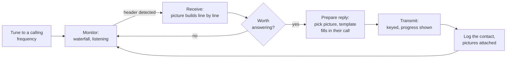

# UI and UX design

One design, three implementations. Because the Pi, Linux and Apple front ends
are built with different toolkits
([ADR-0002](../decisions/0002-three-front-ends.md)), this document is the
contract between them: the same concepts, the same vocabulary, the same
decisions about what is one tap away.

It describes behaviour and layout, not pixels. Each front end follows its
platform's conventions for how things look and move.

## The operator's day

SSTV is a slow conversation. A picture takes one to five minutes to arrive,
and the operator is doing something else for most of that time: watching the
waterfall, preparing a reply, writing in the log. The interface has to be
readable from across the room and must never demand attention at the wrong
moment.



Two things follow from this shape:

1. **Receiving is the resting state.** The application returns to monitoring
   by itself, after transmitting and after any dialog.
2. **Preparing a reply happens while receiving.** Composing must never
   interrupt the decoder or hide the incoming picture.

## Screens

Five places, plus settings. Every front end uses these names.

| Screen | Purpose | Always reachable |
| --- | --- | --- |
| **Monitor** | Waterfall, signal level, current mode, incoming picture | Yes, one tap |
| **Compose** | The picture to transmit, its template, the target mode, the TX button | Yes, one tap |
| **Library** | Received and outgoing pictures, searchable | Yes |
| **Log** | Contacts, ADIF import and export | Yes |
| **Station** | Audio devices, keying, rig, identity, profiles, diagnostics | Two taps |

The Station screen is built from `config.describe`, so a new setting appears
in every front end without three code changes
([the API](api-specification.md#methods)). Only settings an operator can act
on are shown; anything derivable is derived.

Monitor and Compose are the two the operator lives in. On a desktop they can
be side by side; on a phone they are the two primary tabs.

## Monitor

```text
┌──────────────────────────────────────────────┬───────────────────┐
│  RX  Martin 1 · 14.230 MHz · 78%             │  Waterfall        │
│ ┌──────────────────────────────────────────┐ │  ▓▒░ ░▒▓          │
│ │                                          │ │  1200 ─────       │
│ │        picture builds downward           │ │  1500 ─────       │
│ │        ─────────────── current line      │ │  1900 ─ ─ ─       │
│ │                                          │ │  2300 ─────       │
│ └──────────────────────────────────────────┘ │                   │
│  ⏱ 1:12 of 1:54     ◉ sync good              │  Level ▁▃▅▇▅▃     │
├──────────────────────────────────────────────┴───────────────────┤
│  [Auto ▾]  [Scottie 1] [Martin 1] [PD120] …   [Slant] [Save]     │
└──────────────────────────────────────────────────────────────────┘
```

- The **picture is the largest thing on screen** while receiving.
- **Mode buttons stay visible**, as in MMSSTV: starting manually mid-picture
  is a normal action, not a menu dive.
- **Sync quality is stated plainly** ("sync good", "sync lost, still
  drawing"), never as a bare number.
- **Slant and phase are direct manipulation**: drag the picture's edge to
  straighten it, with a "keep this correction" action afterwards. The
  two-click ritual of the original is gone, the capability is not.
- The waterfall carries the four marker lines at 1200, 1500, 1900 and 2300 Hz
  (`R-RX-5`), because tuning against them is the skill operators already have.

## Compose

```text
┌──────────────────────────────────────────────┬───────────────────┐
│  TX  Martin 1 · 1:54                         │  Template         │
│ ┌──────────────────────────────────────────┐ │  ┌─────────────┐  │
│ │   picture + template, exactly as sent    │ │  │ Fields      │  │
│ │                                          │ │  │ Their call  │  │
│ │   G0ABC de M0XYZ  599                    │ │  │ [G0ABC    ] │  │
│ │                                          │ │  │ Report      │  │
│ └──────────────────────────────────────────┘ │  │ [599      ] │  │
│  [Choose picture] [Crop] [Template ▾]        │  └─────────────┘  │
├──────────────────────────────────────────────┴───────────────────┤
│         ▶ TRANSMIT  (Martin 1, 1:54)                             │
└──────────────────────────────────────────────────────────────────┘
```

- **What you see is what you transmit.** Preserved from MMSSTV without
  compromise: the preview is the rendered output, template included.
- **Template fields are a form**, not a drawing exercise. Typing a callsign
  updates the preview. Designing the template is a separate, rarer task.
- **Transmit is deliberate and abortable.** One clear control to start; while
  transmitting it becomes a full-width **STOP**, reachable without aiming,
  because aborting is an urgent action.
- Mode and duration are shown on the button itself: the operator should never
  be surprised by a four-minute transmission.

## Transmitting, and when it goes wrong

| State | What the operator sees |
| --- | --- |
| Keying armed | Brief "keying…" with the method named (VOX, RTS, CAT) |
| Transmitting | Line marker over the picture, remaining time, prominent STOP |
| Aborted | Returns to Monitor, states that the transmission was cut short |
| Failed to unkey | **Full-screen alarm**, persistent, with instructions to switch off the radio, and the release retried in the background |

That last row is the most important screen in the application
([the watchdog](application-architecture.md#radio-control)). It is loud,
impossible to dismiss accidentally, and identical on all three front ends.

## Flows that are not screens

Four guided flows carry more of the product's success than any screen, and
were missing from the first draft of this document.

### First run (`R-CFG-7`)

The gap between installing and receiving a first picture is where most
operators give up. Four steps, skippable, resumable:

1. **Callsign and grid.** Nothing else asked yet.
2. **Audio input.** Devices listed with live level meters; the operator picks
   the one that moves when the radio is receiving. No jargon, no sample rates.
3. **Listen.** Go straight to Monitor and wait for a picture, with a hint if
   no signal is detected within a minute (wrong device, wrong frequency,
   volume too low).
4. **Later, optional:** transmit setup — output device, drive level, keying
   method and a keying test.

A station that can only receive is a legitimate, finished state. Transmit
setup is never forced.

### Drive calibration (`R-TX-10`)

Over-driving the transmitter is the most common SSTV fault on the air and the
original offered no help at all. The flow: key the radio with a test tone,
raise the level until clipping is detected or ALC moves, back off to the
target, store per device. Presented as "send a test tone and follow the
meter", not as a number to type.

### Slant correction

Automatic by default. When the operator disagrees: drag the edge of the
picture until the vertical lines stand up, see the result immediately, then
choose to apply it once or **keep it as the station default**. The
"remember this" action matters — a sound card's clock error is a property of
the machine, not of the picture.

### Diagnostics (`R-OPS-2`)

One button: "Something is wrong". It collects the diagnostics bundle, shows
what is in it, lets the operator redact callsign and location, and saves it
somewhere they can attach to a message. With no telemetry, this is the only
channel we have, so it has to be obvious.

## States every screen handles

Specified once here rather than three times in three front ends:

| State | Rule |
| --- | --- |
| **Empty** | Say what will appear and how to make it appear ("No pictures yet. Start listening on Monitor"), never a blank panel |
| **Loading** | Only for operations over 200 ms; keep the surrounding interface usable |
| **Degraded** | Name what is missing and what still works: "No rig connected. Frequency will not be recorded" |
| **Error** | The `remedy` text from the API, in plain language, with the action that retries it |
| **Fault** | The persistent alarm, which outranks everything else on screen |
| **Disconnected** | A front end that loses the daemon says so, keeps showing the last known state marked stale, and reconnects on its own |

## Notifications (`R-UX-1`)

The operator is usually doing something else while a picture arrives. A
picture completing, a fault, and a station calling are worth a notification;
nothing else is. Each is a platform notification where one exists, an
on-screen banner on the Pi, and always silenceable.

## Keyboard (desktop)

A desktop station is operated with hands on a keyboard while the radio is
tuned with the other hand:

| Key | Action |
| --- | --- |
| `Space` | Start or stop receiving |
| `T` | Transmit (with confirmation) |
| `Esc` | Abort transmission |
| `1`…`9` | Start receiving in the nth favourite mode |
| `S` | Save the current picture |
| `L` | New log entry for the current context |
| `/` | Search the library |

`Esc` aborting a transmission is deliberately the one destructive shortcut
without confirmation.

## Form factors

| | Pi touchscreen (800×480) | Desktop (≥1280) | Phone (≥375) | Tablet |
| --- | --- | --- | --- | --- |
| Navigation | Bottom tab bar, large targets | Side-by-side panes, menu bar | Bottom tabs | Split view |
| Monitor + Compose | One at a time | Both visible | One at a time | Both visible |
| Waterfall | Collapsible strip | Full panel | Collapsible strip | Full panel |
| Minimum touch target | 44 px | n/a (pointer) | 44 pt | 44 pt |
| Text | Large by default; readable at arm's length | System scale | System scale | System scale |

The Pi layout assumes a finger, poor lighting and a shack bench. Dark theme by
default there; system preference elsewhere.

## Interaction rules

1. **Nothing modal during receive.** Dialogs never cover the incoming picture;
   settings and log entry are non-blocking.
2. **No confirmation for reversible things.** Deleting a picture offers undo
   rather than asking first. Transmitting is the exception: it is not
   reversible, so the control is unambiguous.
3. **Progress is honest.** Show what is actually happening, including "signal
   lost, still drawing" and "clock drifting, correcting".
4. **The last received station is context.** Its callsign flows into the
   template fields and the log entry without retyping.
5. **Every destructive or on-air action is logged**, so the operator can
   reconstruct what the station did while they were away.

## Shared assets

Three implementations only stay coherent if they share more than prose:

- **Design tokens** (`clients/design/tokens.json`): colour roles, spacing
  scale, type scale, status colours, waterfall palette. Each front end maps
  them to its own theming system.
- **Copy strings**: one catalogue, one translation workflow (`R-CFG-4`), so
  the same action has the same name everywhere.
- **Icon set**: one licensed set, exported per platform.
- **Screen inventory**: this document, kept current as screens change.

## Accessibility

- Every control reachable by keyboard on desktop platforms, with a visible
  focus ring.
- Screen-reader labels on all controls; the incoming picture announces mode
  and progress rather than being an unlabelled canvas.
- Contrast at WCAG AA for text and status indication; status never carried by
  colour alone, which matters for the red/green of keyed and unkeyed.
- Text scaling honoured up to 200% without clipping.
- Nothing flashes faster than 3 Hz, waterfall included.

## What each front end does differently

| | Pi (Dear ImGui + SDL3) | Linux (Qt 6 / QML) | macOS / iOS (Flutter) |
| --- | --- | --- | --- |
| Feel | Utilitarian, high contrast, large hit areas | Desktop-native, menus, keyboard shortcuts, window management | Platform-native navigation, gestures, haptics |
| Pictures in | File browser, USB media | File dialogs, drag and drop, clipboard | Photo library, Files, share sheet, camera |
| Settings | Flat list on one screen | Preferences window with sections | Platform settings patterns |
| Notifications | On-screen banner | Desktop notification | System notification, background audio policy |
| Distinctive job | Works on a small screen with a finger | Serious desktop station with a big waterfall | Best portable SSTV app: acoustic coupling, VOX, sharing |

Wireframes for all three are in
[docs/diagrams/wireframes.drawio](../diagrams/wireframes.drawio).
